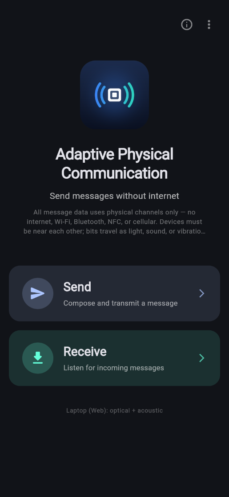
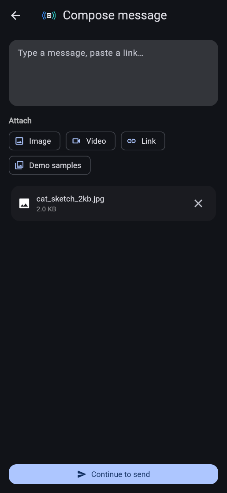
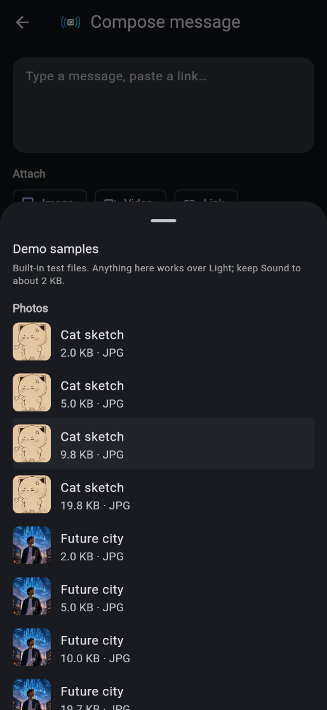
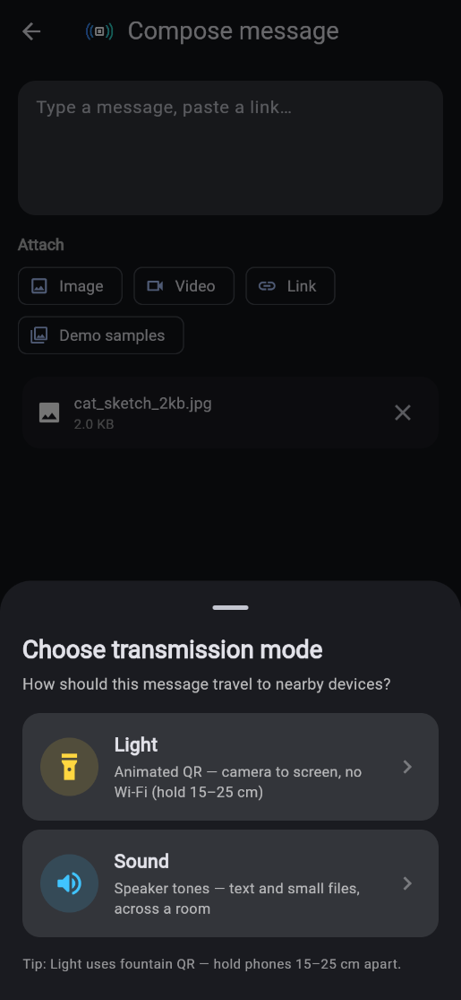
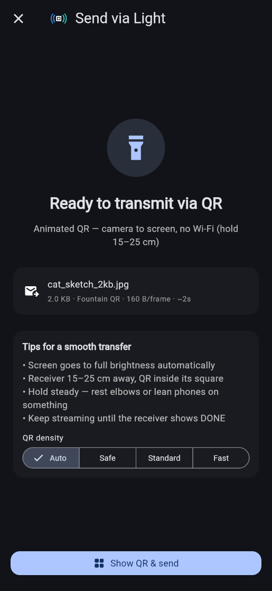
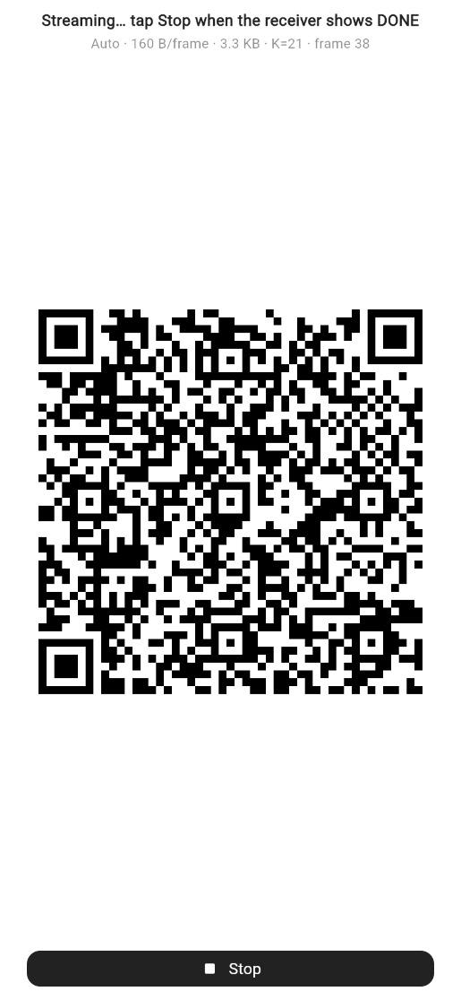
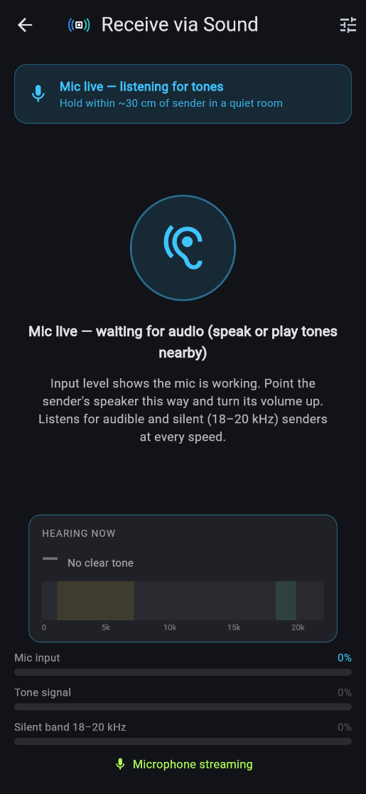

# User Guide

This guide explains, step by step, how to use the Adaptive Physical Communication app to send a message, a link, a photo or a short video from one phone to another without any internet, Wi-Fi, Bluetooth or mobile data. The two phones talk to each other using only **light** (a moving QR code on the screen, read by the other phone's camera), **sound** (tones from the speaker, heard by the other phone's microphone) or **vibration** (buzzes felt by the other phone's motion sensor). You do not need any technical knowledge to follow it. Every button name in this guide is written exactly as it appears in the app.

Back to the [documentation index](../README.md).

---

## Contents

1. [What the app does](#1-what-the-app-does)
2. [Installing the app](#2-installing-the-app)
3. [Permissions the app asks for](#3-permissions-the-app-asks-for)
4. [The Home screen](#4-the-home-screen)
5. [Writing a message (Compose)](#5-writing-a-message-compose)
6. [Choosing how to send: Light, Sound or Vibrate](#6-choosing-how-to-send-light-sound-or-vibrate)
7. [The send screen and its options](#7-the-send-screen-and-its-options)
8. [Receiving a message](#8-receiving-a-message)
9. [The received message card](#9-the-received-message-card)
10. [Getting ready for the next message](#10-getting-ready-for-the-next-message)
11. [Tips for best results](#11-tips-for-best-results)
12. [What to do if…](#12-what-to-do-if)

---

## 1. What the app does

You need **two phones with the app installed**. One phone is the **sender** and the other is the **receiver**. (Light and Sound can also send to several receivers at the same time.)

| Channel | How the message travels | Distance | Good for |
|---|---|---|---|
| **Light** | The sender's screen shows a fast-changing QR code. The receiver points its camera at it. | 15–25 cm | Photos, videos, longer text |
| **Sound** | The sender's speaker plays musical-sounding tones, or with **Silent** tones too high for most people to hear. The receiver listens with its microphone. | Across a table (Silent: within arm's reach) | Short text, links |
| **Vibrate** | The sender's phone buzzes in a pattern. The receiver, pressed against it, feels the buzzes. | Phones touching | A word or two |

Nothing leaves the two phones. Anyone nearby could see the QR code or hear the tones, so do not send secrets.

> **Note:** The screenshots in this guide were taken from the web build of the app in a phone-sized browser window. On a phone, the screens look the same, with two differences: the Home screen's bottom line names your phone's channels, and the **Choose transmission mode** panel also offers **Vibrate**.

---

## 2. Installing the app

### Android

1. Get the file `app-release.apk` from the person who built the app. **Both phones must have the same version** of the app, otherwise the Light channel will not work between them.
2. Copy the APK to the phone (for example with a USB cable), or open it from wherever you received it.
3. Tap the APK file. Android will warn that the app comes from an unknown source.
4. Tap **Settings** in the warning, turn on **Allow from this source** (the wording differs a little between phone brands), then go back and tap **Install**.
5. When installation finishes, tap **Open**. On your home screen the app is called **Adaptive Comm**.

### iPhone

iPhones cannot install APK files. The app has to be installed from a Mac with Xcode by the person who built it. After that, it appears on your home screen as **Adaptive Physical Communication**.

### Laptop (Chrome)

The app can also run in the Chrome browser on a laptop. In Chrome you can use Light (with the webcam) and Sound, but not Vibrate.

---

## 3. Permissions the app asks for

The app asks for permissions the first time it needs them. Please tap **Allow** each time. The app never uses the internet, so these permissions are only used for the physical channels.

| Permission | When it is asked | Why it is needed |
|---|---|---|
| **Camera** | The first time you open **Receive** on a phone | To read the QR code on the other phone |
| **Microphone** | The first time you open **Receive**, and the first time you start sending | To hear Sound messages. The app sets up the microphone for any channel, so this prompt can appear even when you picked Light or Vibrate. |
| **Storage** (Android 9 and older only) | The first time a received photo or video is saved | To put the file in your Gallery. Android 10 and newer do not ask. |
| **Photos** (iPhone only) | The first time a received photo or video is saved | To put the file in the **Adaptive Comm** album |
| **Motion** (iPhone only) | May be asked when you use Vibrate | To feel the vibration pulses |

If you tapped **Don't allow** by mistake, open your phone's **Settings → Apps → Adaptive Comm → Permissions** (or **Settings → Adaptive Physical Communication** on iPhone) and turn the permission on.

---

## 4. The Home screen

When you open the app you see the Home screen.

<em>Figure 1. The Home screen.</em>

From top to bottom it shows:

- Two buttons in the top-right corner:
  - **ⓘ About** opens a box with the app logo, name, version, a one-line description and a **View licenses** button.
  - **⋮** (three dots), labelled **Developer tools**. These tools are for testing and are not needed for normal use.
- The app logo: a white QR corner square between blue and teal signal arcs.
- The app name, **Adaptive Physical Communication**, and the line **Send messages without internet**.
- A short privacy note beginning *"All message data uses physical channels only — no internet, Wi-Fi, Bluetooth, NFC, or cellular."*
- A big **Send** button, with the line **Compose and transmit a message**.
- A big **Receive** button, with the line **Listen for incoming messages**.
- At the bottom, a small line that says what your device can do. On a phone it reads **Phone: optical + acoustic + vibration**. In Chrome it reads **Laptop (Web): optical + acoustic**.

**Before you start:** decide which phone sends and which receives. On the receiving phone, tap **Receive** first so it is ready and listening. Then use **Send** on the other phone.

---

## 5. Writing a message (Compose)

Tap **Send** on the Home screen. The **Compose message** screen opens.

<em>Figure 2. The Compose message screen with a demo photo attached.</em>

### 5.1 Sending text

1. Tap the large box that says **Type a message, paste a link…** and type your message.
2. Tap **Continue to send** at the bottom.

If you tap **Continue to send** with nothing typed and nothing attached, a message at the bottom says **Enter a message or attach content**.

### 5.2 Sending a link

There are two ways:

- **Type or paste it** into the message box. The app recognises text that starts with `http://`, `https://` or `www.`, or that looks like `name.com`, and sends it as a link. If you left out `https://`, the app adds it for you.
- Or tap the **Link** chip under **Attach**. A small window called **Add link** opens. Type the address (the example shown is `https://example.com`) and tap **Add**, or **Cancel** to go back. Adding a link this way clears the message box.

> Note: because of this automatic recognition, a short message that happens to look like a web address (for example `see.you`) is sent as a link.

### 5.3 Sending a photo

1. Tap the **Image** chip under **Attach**.
2. Pick a photo from your phone.
3. The app automatically shrinks the photo so that it is at most about 120 KB, because the physical channels are slow. PNG, WebP and GIF pictures are turned into JPEG.
4. A small card appears showing the file name and size, with an **✕** button (label **Remove attachment**) if you change your mind.
5. Tap **Continue to send**.

If the picture cannot be read, a message at the bottom explains why and nothing is attached.

### 5.4 Sending a video

1. Tap the **Video** chip and pick a video.
2. Videos are **not** shrunk by the app, so choose a very short, small clip. The built-in demo videos (next section) are a good size.
3. If the file is larger than 512 KB, a window called **Large file** warns: *"This file is … KB. Physical channels work best under 512 KB. Transfer may be slow or fail. Continue?"* Tap **Use anyway** to keep it or **Cancel** to choose another.
4. Tap **Continue to send**.

> Important: if you type text **and** attach a photo or video, only the **text** is sent. To send the photo or video, leave the message box empty.

### 5.5 Sending other files

The Compose screen only has chips for **Image**, **Video**, **Link** and **Demo samples**. It has no general "file" option. Documents and other file types can only be sent from the **Legacy Messages** screen under **Developer tools**, which is meant for testing.

### 5.6 Using the built-in Demo samples

The app contains ready-made photos and videos, so you can try it without copying any files to the phone.

1. Tap the **Demo samples** chip.
2. A panel slides up from the bottom. Drag it up to see more. At the top it says **Demo samples** and *"Built-in test files. Anything here works over Light; keep Sound to about 2 KB."*
3. The panel has two lists:
   - **Photos**: four pictures (**Cat sketch**, **Future city**, **Night sky**, **Robot lab**), each in four sizes of about 2, 5, 10 and 20 KB. Each row shows a small preview.
   - **Videos with sound**: **Binary numbers**, **Countdown beeps**, **How QR codes work**, **How sound travels**, **Morse code**, **Photosynthesis**, **Speed of light**, **The water cycle** and **Why we have seasons**. Each row shows a play icon.
4. Under each title you see its size and type, for example `9.8 KB · JPG` or `78.1 KB · WEBM`.
5. Tap a row to attach it, then tap **Continue to send**.

<em>Figure 3. The Demo samples panel. Scroll down for Videos with sound.</em>

**Good first choices:** a 5 KB photo over Light finishes in a few seconds. **Speed of light** (about 78 KB) takes about 40 seconds over Light. The iPhone cannot play or save the **Speed of light** video because it is in WebM format; all other videos are MP4 and work everywhere.

---

## 6. Choosing how to send: Light, Sound or Vibrate

After you tap **Continue to send**, a panel titled **Choose transmission mode** slides up, with the line **How should this message travel to nearby devices?**

<em>Figure 4. The Choose transmission mode panel (web build; phones also show Vibrate).</em>

| Option | Description shown in the app |
|---|---|
| **Light** | Animated QR — camera to screen, no Wi‑Fi (hold 15–25 cm) |
| **Sound** | Speaker tones — text and small files, across a room |
| **Vibrate** | Contact-only — short text, phones pressed together. It also shows **1:1 only — phones must touch** in orange. |

At the bottom is the tip **Tip: Light uses fountain QR — hold phones 15–25 cm apart.** **Vibrate** is not shown when the app runs in Chrome.

Tap the one you want. Swipe the panel down to go back to your message without choosing.

**Which one should I pick?**

- Photo or video: **Light**.
- A sentence or a link: **Light** is fastest; **Sound** works when you cannot point a camera.
- A single word, as a demonstration: **Vibrate**.

---

## 7. The send screen and its options

The next screen is titled **Send via Light**, **Send via Sound** or **Send via Vibrate**. At the top left is an **✕** button (label **Cancel**) that takes you back.

### 7.1 Before you start (the "ready" screen)

The screen shows a large icon and a heading:

| Channel | Heading |
|---|---|
| Light | **Ready to transmit via QR** |
| Sound | **Ready to play** |
| Vibrate | **Ready to vibrate** |

Below it is a card with a preview of your message (the text, or the file name).

<em>Figure 5. The Send via Light screen, ready to send.</em>

#### Light options

The message card has an extra line, for example:

`80.0 KB · Fountain QR · 330 B/frame · ~38s`

This means: the message is 80.0 KB; it is sent as a moving QR code; each QR picture carries 330 bytes; and a receiver that is aimed well should finish in about 38 seconds. (See [7.4 What the time estimate means](#74-what-the-time-estimate-means).)

A card titled **Tips for a smooth transfer** lists:

- • Screen goes to full brightness automatically
- • Receiver 15–25 cm away, QR inside its square
- • Hold steady — rest elbows or lean phones on something
- • Keep streaming until the receiver shows DONE

Under **QR density** are four buttons. The app selects **Auto** every time you open this screen.

| Button | What it does | When to use it |
|---|---|---|
| **Auto** | Chooses the QR size for you: small, easy-to-read codes for small messages, and slightly denser codes only for bigger files. 12 pictures per second. | Almost always. |
| **Safe** | The simplest, easiest-to-read code (160 bytes per picture), shown more slowly (8 per second). | The receiver is far away, shaky, or the screen looks washed out. |
| **Standard** | A denser code (330 bytes per picture), 12 per second. | Both phones are held very steady. |
| **Fast** | The densest code (600 bytes per picture), 12 per second. | Only when the phones are close, steady (for example propped up) and the light is good. |

When you change the density, the size, bytes-per-frame and time estimate in the line above update.

#### Sound options

A card titled **Tips for a smooth transfer** lists, for **Audible**:

- • Volume up, speaker facing the receiver
- • Works across a table; quieter is faster
- • Lost frames are OK — fountain recovers

and for **Silent**:

- • Silent: 18–20 kHz, you will not hear it
- • Media volume to max, speaker facing the mic
- • 10–50 cm apart; hold both phones still
- • Nothing arriving? Some phones cannot play or hear 18 kHz — switch to Audible

**Sound band** has two buttons:

- **Audible** plays chirpy chords you can hear. It is the fastest and works on every phone.
- **Silent** plays very high tones (18–20 kHz) that most adults cannot hear. It is slower, needs the phones closer together, and only works if both phones' speaker and microphone can handle such high sounds. Most recent phones can; try it before a demo.

Under **Speed** are the buttons for the chosen band. Each shows its speed in bytes per second. The app starts on **Standard**; switching band picks **Standard** or **Silent**. Your choice is remembered until you close the app.

| Band | Button | Best for (hint shown in the app) |
|---|---|---|
| Audible | **Fast · 36 B/s** | Quiet room, phones touching |
| Audible | **Standard · 27 B/s** | Normal room, across a table |
| Audible | **Safe · 18 B/s** | Background noise or chatter |
| Audible | **Rugged · 11 B/s** | Loud room, phones metres apart |
| Silent | **Silent · 5.0 B/s** | Inaudible 18–20 kHz, phones within arm's reach |
| Silent | **Silent Robust · 3.4 B/s** | Inaudible, weak speaker or a loud crowd |

Under the buttons the app repeats the hint for the selected speed, followed by *"The receiving phone detects the band and speed by itself."* You do **not** need to choose anything on the receiving phone.

Next comes **FRAME TO BE SENT**: a coloured bar showing how each sound frame's time is spent (**Marker**, the start signal; **Header**; **Message**, your data; **CRC**, a check; and **Parity**, the repair data that lets a damaged frame be fixed). Under it are the **TONES** range in kHz, the length of one **FRAME** in seconds, and how many **FRAMES** your message needs at minimum. A one-line text fits in one frame: 2.4 s on Standard, 4.8 s on Silent.

Below that is a line such as `24 B on air · ~10s typical`: the size of your message as sent, and roughly how long it takes at the chosen speed in a normal room. When every frame is heard cleanly it is quicker, down to the time shown under **FRAMES**.

#### Vibrate options

There are no options. An orange label reads **Contact required — 1:1 only**.

### 7.2 Starting to send

Tap the big button at the bottom:

| Channel | Button |
|---|---|
| Light | **Show QR & send** |
| Sound | **Play & send** |
| Vibrate | **Start vibration** |

#### While sending over Light

The whole screen turns white and shows a large black-and-white QR code that changes about 12 times per second. Your screen brightness goes to maximum automatically and returns to normal afterwards.

<em>Figure 6. Sending over Light. The QR code changes about 12 times per second. The 2.0 KB photo is 3.3 KB on air because the app re-encodes photos before sending (see <a href="../project/KNOWN_ISSUES.md#41-photos-are-re-compressed-and-grow-medium">Known Issues §4.1</a>).</em>

- At the top it says **Streaming… tap Stop when the receiver shows DONE**.
- Under that is a small grey line such as `Auto · 330 B/frame · 80 KB · K=243 · frame 57`. It shows the density, the bytes per picture, the file size, the number of pieces the file was cut into (**K**) and which picture is being shown now. You can ignore it.
- At the bottom is a black **Stop** button.

The QR code **never stops on its own** (except after a 10-minute safety limit), because the sending phone has no way of knowing when the receiver has finished. Watch the receiving phone. When it shows **DONE** (or the message appears), tap **Stop**.

#### While sending over Sound

The screen shows a pulsing sound icon and **Playing acoustic tones…**, with the reminder *"Volume up, speaker facing the other phone. Keep playing until the other device says it has the message."*

Below the progress card, **Sending now** shows the frequency being played at this moment, in kHz, and a small 0–22 kHz strip with a line for each tone. Audible sends play several tones at once (for example *1.94–6.80 kHz · 8 tones at once*). Silent sends play one tone between 18.3 and 19.9 kHz.

A card appears with:

- **Playing … B · Standard** (the size and the speed you chose),
- a progress bar,
- *"Turn the volume up and point the speaker at the other phone. About …s if it is heard cleanly."* On **Silent** it reads *"Playing 18–20 kHz tones — you will not hear them…"*, and the icon changes to a crossed-out ear. Hearing nothing is normal; you may notice a faint tick at the start and end of each burst on some phones.
- a **Stop** button on the right.

The progress bar fills when the usual amount of sound has been played. Sound keeps playing after that, in case the receiver missed some parts, until you tap **Stop** or a built-in limit is reached. When the receiver shows the message, tap **Stop** on this card. The tones stop straight away.

At the very bottom there is also a **Cancel transmission** button. It stops the tones and leaves the send screen, as do the **✕** button and the back button.

#### While sending over Vibrate

The screen shows a pulsing vibration icon with **Vibrating…** (or **Transmitting…** between buzzes) and *"Hold phones together — vibration is contact-only (1:1)"*. Keep the phones pressed together until it finishes. **Cancel transmission** at the bottom stops it.

Vibration is very slow: even a two-letter message takes more than a minute.

### 7.3 When sending ends

| Situation | What you see | Buttons |
|---|---|---|
| You tapped **Stop** on Light (or the 10-minute limit was reached) | **Streaming stopped**, with a line such as *"Streaming stopped (463 QR frames in 38s). If the receiver shows DONE, the file arrived; otherwise tap Resume — it keeps its progress."* | **Receiver shows DONE** and **Resume streaming** |
| Sound finished or you tapped **Stop**; Vibrate finished successfully | **Sent successfully** | **Done** |
| Something went wrong | **Send failed**, with the reason | **Back** and **Retry** |

- **Receiver shows DONE**: tap this when the receiving phone has the message. It takes you back to the Compose screen.
- **Resume streaming**: tap this if the receiver has **not** finished. The QR code starts again and continues with **new** pieces; the receiving phone keeps everything it has already collected, so nothing is wasted.
- **Retry** returns to the ready screen so you can try again. **Back** returns to Compose.

Pressing your phone's **back** button while sending cancels the send and leaves the screen.

### 7.4 What the time estimate means

The number after **~** (for example **~38s**) is how long a well-aimed, steady receiver typically needs, not how long the sender plays.

- **Light:** it assumes the receiver reads a typical share of the QR pictures it sees. If the receiver is badly aimed or shaky, it takes longer. If it is perfectly aimed, it can be quicker.
- **Sound:** it assumes a normal room where some sound frames are lost. In a quiet room it can be quicker; in a noisy room, longer.

Either way, keep sending until the receiver says it is done.

---

## 8. Receiving a message

1. On the receiving phone, tap **Receive** on the Home screen.
2. A panel titled **Choose receive mode** appears with the line **How should this device listen for messages?** It has the same three options as the sender. **Pick the same channel as the sender.** If you swipe the panel away, you go back to the Home screen.
3. The screen title becomes **Receive via Light**, **Receive via Sound** or **Receive via Vibrate**. To switch channel later, tap the **Change mode** button (sliders icon) in the top-right corner.

Leaving the Receive screen (the back arrow) stops the camera, microphone or motion sensor.

At the top of the screen is a coloured status banner that tells you what the phone is doing. When a message arrives, the banner turns green and reads **Message received — still listening**.

### 8.1 Receiving over Light

The screen shows the camera view with four white **corner brackets** marking a square. Only the part inside the square is read.

**How to hold the phone:**

1. Hold the receiving phone **15–25 cm** from the sender's screen. Closer is **not** better: many phone cameras cannot focus closer than that.
2. Move until the **whole QR code is inside the corner brackets**. It should fill most of the square without its corners touching the brackets.
3. Keep still. Rest your elbows on a table, or lean the phones against something.
4. If the picture looks blurry, **tap the camera view** on the QR code. This makes the camera focus again at that spot.
5. Tilt slightly if you see a bright reflection on the sender's screen.

**Zoom chips (top-right of the camera view):** **1x**, **1.5x**, **2x**, **3x**. The camera starts at **1.5x**. The selected chip is white. If the QR code looks small, tap **2x**; this lets you stay at a comfortable distance while the code still fills the square. Only the zoom levels your camera supports are shown, and the chips are hidden if your camera has no zoom.

**The status box (HUD) at the bottom of the camera view:**

The first row shows a status badge:

| Badge | Meaning |
|---|---|
| **SCAN** (grey) | Looking for a QR code; nothing read yet. |
| **LOCK** (blue) | Found the sender's code and collecting pieces. |
| **DONE** (green) | The whole message has been received. |

Next to the badge, **SID** is a short code identifying this transfer (you can ignore it). On the right it shows the density name, or **K=** followed by the number of pieces once locked.

The second row shows live numbers:

| Label | What it means | What a good value looks like |
|---|---|---|
| **CAP** | How many camera pictures per second the phone is taking | Around 15–30 |
| **DEC** | How many QR codes per second are successfully read | The higher the better; several per second is good |
| **DROP** | Camera pictures skipped because the phone was still busy reading the previous one | Any number is fine; this is normal |
| **GOOD** | Useful data received per second, in KB/s | Rises while receiving |
| **NEW/DUP/RED** | Useful new pieces / pieces already received / pieces that added nothing new | NEW should keep climbing |

When a transfer is in progress, a thin progress bar appears with a line such as **120 / 243 symbols · 330 B** (pieces collected / pieces needed, and bytes per piece). The file is complete when the first number reaches the second.

If the camera is working but no QR code can be read for a few seconds, an amber hint appears:
*"No codes readable — whole QR inside the square at 15–25 cm, hold steady, tap to refocus, or try 2x zoom"*. If some progress was already made, it starts with **Progress kept.**, which means nothing is lost; just re-aim.

**Below the camera view** is a progress bar and one of these messages:

| Message | Meaning |
|---|---|
| *Hold 15–25 cm away, whole QR inside the square · tap to refocus* | Waiting for a QR code |
| *Reading QR…* | Something QR-like is being read |
| *Decoding — 120 / 243 symbols · keep steady* | Collecting pieces |
| *Progress kept (120 / 243) — re-aim: whole QR inside the square, hold steady* | Stalled; re-aim |

The status banner at the top may also read **Receiving fountain QR 120 / 243 symbols** with *Keep camera aimed at the sender QR*.

If you move away, lose the code, or even leave and re-open the screen, the phone **keeps the pieces it already has** (for up to 3 different transfers). Aim again and it continues.

When the file is complete, a green **Transfer complete** card may briefly show the size, time and speed (for example *80.0 KB in 41.2s (1.9 KB/s)*), and then the message itself appears.

### 8.2 Receiving over Sound

<em>Figure 7. Receiving over Sound, listening before the sender starts.</em>

1. Allow the microphone if asked.
2. Place the receiving phone so its microphone (usually at the bottom edge) faces the sender's speaker, across a table at most. A quiet room is faster.
3. Ask the sender to tap **Play & send**.

The screen shows a pulsing ear icon (blue when listening, amber when it hears tones) and a status line such as:

| Status | Meaning |
|---|---|
| *Starting microphone…* | Getting ready |
| *Mic live — waiting for audio (speak or play tones nearby)* | Microphone works but hears almost nothing |
| *Mic live — listening for sender tones* | Ready and listening |
| *Tones detected — decoding message* | Hearing the sender |
| *Receiving — 3 of 5 blocks* | Collecting pieces |
| *Message decoded — ready for next* | Done |
| *Microphone permission required* | The microphone is blocked |

**Receive progress card** (appears while a message is arriving):

- **Receiving over sound · Standard**: the speed is detected from the sender automatically.
- A percentage and a progress bar.
- A line such as **3 of 5 blocks · 4 frames read · 1 too damaged**:
  - **blocks**: pieces of the message recovered so far, out of the number needed;
  - **frames read**: sound frames that were heard and repaired successfully;
  - **too damaged**: frames heard but too noisy to use (only shown when above zero). A few are normal; if this keeps rising, see [section 12](#12-what-to-do-if).
- *Keep the sender playing until this completes.*

**Meters at the bottom:**

- **Mic input** (percentage): how loud the microphone hears the room. If it stays at 0%, the microphone is not working.
- **Tone signal** (percentage): how strongly the sender's tones are heard. It turns amber above about 12%. While a message is arriving, it rises with progress.
- **Silent band 18–20 kHz** (percentage): how much very high sound the microphone hears. It turns teal above about 30%. When the sender uses **Silent**, this is the meter to watch: **Mic input** barely notices such high tones, and **Tone signal** simply follows this one. If it stays near 0% while a Silent sender plays, one of the phones can't handle those frequencies: ask the sender to switch to **Audible**.
- **Hearing now**: the strongest frequency the microphone picks up, in kHz, with its level and a 0–22 kHz spectrum strip. When the sound is getting through, it matches the sender's **Sending now**. It shows **—** when nothing stands out from the background noise.
- A line reading **Microphone streaming** (green) or **Microphone not active** (red).
- If the microphone is not running, an **Enable microphone** button appears. Tap it to ask for permission again and restart listening.

The status banner at the top shows messages such as **Mic live — listening for tones** (*Hold within ~30 cm of sender in a quiet room*), **Tones detected — decoding…** (*Hold phones close until message appears*), **Microphone blocked** (*Tap Enable microphone below*) and **Sound message decoded**.

### 8.3 Receiving over Vibrate

1. Choose **Vibrate** on **both** phones. Open Receive on this phone **before** the sender taps **Start vibration**.
2. Place the phones **touching**, for example back to back or one on top of the other on a table, and press them together firmly.

The screen shows **Detecting vibration…** and *"Press phones together firmly. Vibration is contact-only and best for short text."* Below it, **Signal …%** shows how strongly this phone feels movement. It jumps up when the other phone buzzes. Keep the phones still between buzzes.

---

## 9. The received message card

When a message arrives it replaces the camera view or meters and fills the screen. The card's header shows the type (**Text message**, **Link**, **Image**, **Video** or **File**) and the size.

| Type | What you see and can do |
|---|---|
| **Text message** | The text in large print. Press and hold to select and copy it. |
| **Link** | The address, underlined (you can select and copy it), and an **Open link** button that opens it in your browser. If it cannot be opened, you see **Invalid URL** or **Could not open link**. (Opening a web page needs internet; receiving the link does not.) |
| **Image** | The photo. **Tap it** to open it full screen on a black background; **pinch with two fingers** to zoom and drag to move around. Tap outside the picture or press back to close. |
| **Video** | The video **starts playing automatically, with sound, and repeats**. Use the round play/pause button below it; the time shows as `00:12 / 00:24`. If a video cannot be played you see *Could not play video (… bytes)*. |
| **File** | The file name and size. The app does not open or save other file types. |

Under the card, a small line says **Photo received — still listening for more**, **Playing received video — still listening for more** or **Still listening — send another message anytime**.

### Saving to the Gallery

Received **photos and videos are saved to your Gallery automatically**, in an album called **Adaptive Comm**. The status banner then reads **Photo saved to Gallery (Adaptive Comm)** (or **Video saved…**). Each message is only ever saved once.

The button under a photo or video shows the save state:

| Button | Meaning |
|---|---|
| **Save to Gallery** | Not saved yet. Tap to save. |
| **Saving to Gallery…** (with a spinner) | Saving now. |
| **Saved to Gallery · Adaptive Comm** (with a green tick, greyed out) | Saved. |
| **Retry save**, with an orange reason underneath | Saving failed. Fix the reason and tap to try again. |

Possible reasons: **Gallery permission denied**, **Not enough storage**, **Format not supported by the gallery** or **Could not save to gallery**. The Gallery button does not appear when the app runs in Chrome.

To find saved files, open your phone's **Gallery** or **Photos** app and look for the **Adaptive Comm** album.

---

## 10. Getting ready for the next message

The phone **keeps listening** while it shows a message. To clear the screen and wait for the next one, tap **Clear & keep listening** under the card. The camera view or meters come back.

If a message you already received appears as soon as you open the Receive screen, it is the last message from before; tap **Clear & keep listening** to hide it.

---

## 11. Tips for best results

### Light

- **Sender:** keep the screen clean. Brightness is set to maximum automatically. Avoid a cracked area of the screen.
- **Receiver:** 15–25 cm away, whole QR inside the brackets, elbows resting on a table.
- If the code looks small, use **2x** rather than moving closer.
- Tap the camera view to refocus whenever the code looks soft.
- Tilt a little to get rid of reflections from lamps or windows.
- Leave **QR density** on **Auto**. If **DEC** stays low even though **CAP** is fine, switch the sender to **Safe**.
- Several receivers can read the same screen at once.
- A photo of 5 KB takes a few seconds; the 78 KB **Speed of light** video takes about 40 seconds.

### Sound

- Turn the sender's volume all the way up.
- Point the sender's speaker at the receiver's microphone; keep them close.
- Quieter rooms are faster. In a noisy place, choose **Safe** or **Rugged** on the sender only; the receiver adjusts by itself.
- To send without anyone hearing, choose **Silent**. Turn the media volume to maximum, keep the phones 10–50 cm apart and hold them still. **Silent Robust** helps in a loud crowd or with a weak speaker. Background talking and music barely affect Silent, because they are much lower in pitch.
- Keep messages short: Sound is best for text and links. Photos over about 2 KB take minutes.
- Several receivers can listen at once.

### Vibrate

- Start **Receive → Vibrate** on the receiving phone first.
- Press the phones firmly together on a solid table, and do not touch them while they buzz.
- Keep it to one short word.

---

## 12. What to do if…

| Problem | What to do |
|---|---|
| **The receiver stays on SCAN** | Hold 15–25 cm away with the whole QR inside the brackets. Tap the camera view to focus. Try **2x**. Tilt to remove glare. Make sure both phones have the **same version** of the app. |
| **DEC is low but CAP is fine** | Hold steadier (rest your elbows), switch the sender's **QR density** to **Safe**, and wipe the camera lens. |
| **Progress stops at "… / … symbols"** | Keep the sender streaming and re-aim. If the sender already stopped, tap **Resume streaming** on the sender. The receiver kept its progress. |
| **The camera view just says "Starting camera…"** | The camera permission is probably off. Turn it on in the phone's Settings, then leave and reopen **Receive**. |
| **Sound: nothing happens** | Tap **Enable microphone**. Check that **Mic input** moves when you speak. Turn the sender's volume up and check that **Tone signal** moves while it plays. |
| **Sound: "too damaged" keeps rising** | Turn the volume up, point the speaker at the microphone, move closer, or choose **Rugged** on the sender. |
| **Sound: Silent sends never arrive** | Look at the receiver's **Silent band 18–20 kHz** meter while the sender plays. If it stays near 0%, turn the sender's media volume to maximum and disconnect Bluetooth headphones; then try swapping which phone sends. If it still doesn't move, one phone can't play or hear 18–20 kHz: use **Audible**. If it moves but nothing decodes, move closer, hold still, or choose **Silent Robust**. |
| **Sound: the two readouts disagree** | Compare the sender's **Sending now** with the receiver's **Hearing now**. If the receiver shows **—**, the sound isn't reaching it: volume up, move closer, uncover the speaker and microphone. If it shows a different steady frequency, something nearby (a fan, a charger, another app) is louder than the sender. The sender's readout may change a split second before the sound; that's normal. |
| **Vibrate: "Send failed"** | Make sure the other phone is on **Receive → Vibrate** before you start, press the phones together firmly, and tap **Retry**. |
| **"Payload too large for Light fountain QR"** | The file is too big. Choose a smaller photo or video. |
| **A photo is not in the Gallery** | Look in the **Adaptive Comm** album. Tap **Retry save** on the card. On Android 9 or older, allow storage access. |
| **A video will not play on iPhone** | Use an MP4 video. iPhones cannot play or save WebM videos such as **Speed of light**. |
| **An old message appears when I open Receive** | Tap **Clear & keep listening**. |

For more help see the [FAQ](FAQ.md), the [Troubleshooting guide](../operations/TROUBLESHOOTING.md) and the [Showcase guide](SHOWCASE_GUIDE.md) for running a demonstration. For how each channel works, see [Light](../channels/LIGHT_CHANNEL.md), [Sound](../channels/SOUND_CHANNEL.md) and [Vibration](../channels/VIBRATION_CHANNEL.md).
